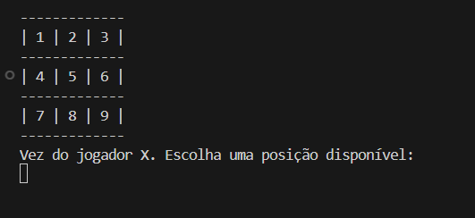
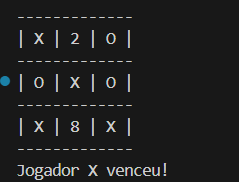

# Tic-Tac-Toe #️⃣

Implementação do jogo da velha em C#, jogável no terminal onde dois jogadores se alternam para marcar "X" e "O" em uma matriz 3x3.

## 🎮 Como compilar e executar  
  
1️⃣ Certifique-se de ter o **.NET SDK** instalado.  


2️⃣ No terminal, navegue até a pasta do projeto:  
   ```sh
   cd caminho/do/repo
```
3️⃣ Execute o jogo com:

```sh
  dotnet run
```

## 🖼️ Telas do Jogo  

### Tela do Jogo
Aqui está uma captura de tela do jogo:



### Tela de Vitória
E aqui está a captura de tela quando um jogador vence:


